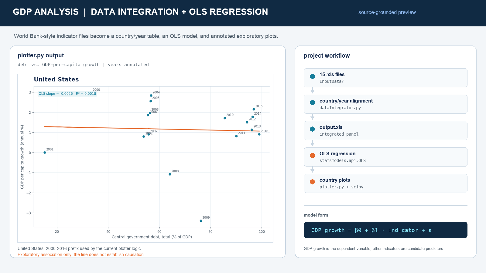
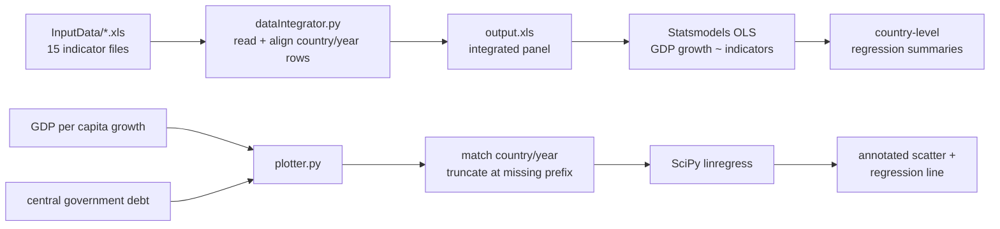

# GDP Indicator Analysis - Country-Level Linear Regression



A Python data-analysis workflow for investigating relationships between GDP growth and economic indicators across countries. The project combines multiple World Bank-style Excel exports into a country/year panel, fits country-level ordinary least squares models, and produces annotated regression plots for exploring relationships such as central government debt versus GDP-per-capita growth.

The analytical core is **classical machine learning through interpretable linear regression**. It estimates coefficients relating country-level GDP indicators, produces fitted values and plots, and keeps the calculations inspectable. The results are intended for exploratory economic analysis and require careful treatment of missing values, confounding variables, and causal interpretation.

## Recommended project identity

**Recommended repository name:** `gdp-country-indicator-regression`

**GitHub About description:**

> Python workflow for integrating World Bank economic indicators, building country/year panels, fitting OLS regressions, and visualizing debt–GDP growth relationships.

## What the project does

- Reads 15 country-level indicator spreadsheets from `InputData/`.
- Integrates the indicators into a combined `output.xls` workbook.
- Separates GDP-per-capita growth as the response variable and treats other indicators as candidate predictors.
- Fits an OLS model for each country with Statsmodels.
- Prints regression summaries with coefficients and statistical diagnostics.
- Builds annotated country plots with SciPy’s `linregress`.
- Visualizes the relationship between central government debt and GDP-per-capita growth over time.
- Annotates observations with their corresponding year so the trend can be inspected as a time sequence.

## Analysis workflow



`dataIntegrator.py` and `plotter.py` are complementary experiments. The integrator creates a multi-indicator regression design and prints Statsmodels results. The plotter focuses on one interpretable two-variable relationship and displays it visually for each country with sufficient data.

## Indicators in the project

The input directory includes measures such as:

- GDP per capita growth (annual %) - the modeled response.
- Central government debt (% of GDP).
- Real interest rate (%).
- Net lending/borrowing (% of GDP).
- Tax revenue (% of GDP).
- Exports and imports of goods and services (% of GDP).
- Gross capital formation (% of GDP).
- GDP deflator growth.
- School enrollment, secondary (% gross).
- Unemployment (% of the labor force).
- Population growth.
- Net barter terms of trade index.
- Total investment (% of GDP).
- General government total expenditure.

The files use the familiar World Bank indicator export layout: metadata rows followed by country rows and year columns. The scripts currently rely on positional row/column conventions from that layout.

## How the data integrator works

`dataIntegrator.py`:

1. Reads every file in `InputData/` with Pandas.
2. Copies the shared metadata rows into a new output frame.
3. Decomposes each indicator into country records and yearly values.
4. Groups non-GDP indicators into a country-specific feature structure.
5. Stores GDP-per-capita growth separately as the response vector.
6. Adds an intercept with `statsmodels.api.add_constant()`.
7. Fits `statsmodels.api.OLS(y, x, missing="drop")` for each country.
8. Prints the Statsmodels regression summary for inspection.

The generated `output.xls` is an intermediate integration artifact, not a trained model. It makes the merged panel available for spreadsheet inspection and downstream analysis.

## How the plotter works

`plotter.py` loads the GDP-per-capita-growth and central-government-debt files, matches the rows by country position, and extracts the shared year columns. For each country with a non-missing starting debt value, it:

1. Uses the contiguous prefix before the first missing debt value.
2. Fits `scipy.stats.linregress(x, y)`.
3. Computes predicted values from `slope * x + intercept`.
4. Draws a scatter plot and regression line.
5. Labels each point with its year.

This produces an intuitive visual diagnostic, but the line should be read as an exploratory association. It does not prove that debt causes GDP growth or that the relationship generalizes beyond the observed country and period.

## Project structure

```text
.
├── dataIntegrator.py       # Multi-indicator integration and OLS summaries
├── plotter.py              # Country-level debt/GDP regression plots
├── output.xls              # Committed integrated data artifact
├── InputData/
│   ├── API_*.xls           # World Bank-style indicator exports
│   ├── data.xls            # Additional indicator input
│   └── new.xls             # Additional indicator input
└── docs/
    └── gdp-linear-regression-preview.png
```

## Run locally

### Requirements

- Python 3.8+.
- Pandas and NumPy for data preparation.
- `xlrd` for reading the legacy `.xls` files.
- Statsmodels for OLS regression summaries.
- SciPy for two-variable linear regression.
- Matplotlib for plots.

Install the dependencies in an isolated environment:

```bash
python3 -m venv .venv
source .venv/bin/activate
python -m pip install --upgrade pip
python -m pip install pandas numpy xlrd statsmodels scipy matplotlib
```

Run the integration and regression summaries from the repository root:

```bash
python dataIntegrator.py
```

Run the country-level visualization workflow:

```bash
python plotter.py
```

The plotter opens one Matplotlib figure per country that has a usable contiguous data prefix. Depending on the environment, use a desktop Matplotlib backend or replace `plt.show()` with `plt.savefig(...)` for headless execution.

## Interpretation and responsible use

This project is best understood as an exploratory regression study:

- OLS coefficients describe conditional linear associations under the model assumptions.
- Missing observations are dropped by Statsmodels and truncated in the plotter’s prefix logic.
- Country-level economic indicators can be correlated with each other, making coefficient interpretation sensitive to multicollinearity.
- Time trends, policy changes, reverse causality, and omitted variables can all affect the observed relationships.
- A high or low R-squared value does not by itself establish an economic mechanism.

The correct next step for a research-grade result is to add a documented sample definition, time controls, diagnostics, confidence intervals, and a defensible identification strategy rather than treating a fitted line as causal evidence.

## Engineering limitations and next steps

The code is a useful data-analysis prototype, with several clear opportunities to make it more robust:

- Replace positional row matching with explicit joins on country code and year.
- Preserve indicator ordering instead of relying on `os.listdir()` order and a hard-coded `numberOfInputFiles = 15`.
- Normalize the spreadsheet headers into a tidy table with columns such as `country`, `country_code`, `indicator`, `year`, and `value`.
- Add schema validation for missing files, duplicate countries, unexpected metadata rows, and inconsistent year ranges.
- Keep feature names aligned with the design matrix; converting `xNames` to a set currently loses deterministic ordering.
- Add command-line options for input directory, target indicator, predictor selection, country, and output location.
- Export regression summaries and plots instead of relying only on console output and interactive `plt.show()`.
- Add residual plots, confidence intervals, multicollinearity diagnostics, robust standard errors, and influence checks.
- Add tests for data alignment, missing-value handling, regression inputs, and plot-ready country series.
- Pin dependencies and add a reproducible environment file or `pyproject.toml`.
- Separate exploratory notebooks/plots from the reusable data and modeling modules.
- Replace the legacy `from numpy import NaN` import with `np.nan` for compatibility with current NumPy releases.

## Verification

The tracked Python modules pass syntax compilation:

```bash
python3 -m py_compile dataIntegrator.py plotter.py
```

The tracked Python modules pass syntax compilation, and `plotter.py` completed a headless run against the included indicator files in a temporary environment. `dataIntegrator.py` currently stops at runtime on modern NumPy because of its legacy `from numpy import NaN` import; after that compatibility fix, it also requires the listed statistical dependencies. The preview image is generated from the project’s actual GDP/debt inputs using the same country-level regression relationship and mirrors the integration stages implemented by the source.
